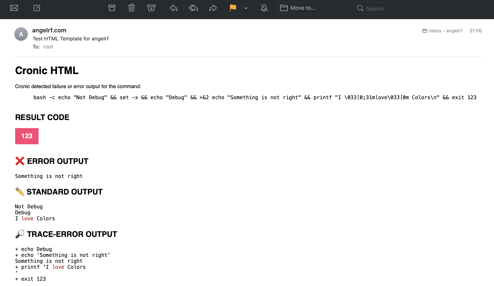

# Cronic HTML
A cure for Cron's chronic email problem.

🤒 The Disease:
```bash
0 1 * * * backup >/dev/null 2>&1
```

💊 The Cure:
```bash
0 1 * * * cronic-html backup
```

This project is is fork of [cronic](https://habilis.net/cronic/) and includes some new features. 

Learn more about `cronic` in their website <https://habilis.net/cronic>.

## What can I do with Cronic HTML?

You can create cron jobs that run your script, and make sure that you are notified when they fail.

The received email will contain:
  * The failed command
  * The return code
  * The standard output (stdout), so you get a context of the error
  * The standard error (stderr), so you get a context of the error
  * Any debug trace. Output when the script has `set -x` in it

You will never find yourself redirecting the output to `/dev/null` 😎

<p align="center">
  
  <sub>Example of a script returning <strong>133</strong> and some outputs in <strong>stdout</strong>, <strong>stderr</strong>, and <strong>trace-debug</strong></
</p>
<br /><br />

<p align="center">
   <br />
  <sub>Example of a script returning <strong>0</strong> and some outputs in <strong>stdout</strong> and <strong>stderr</strong></sub>
</p>


## What advantages has Cronic HTML over Cronic
Cronic is a great and simple script, and does his work very well, however due to this simplicity, it cannot handle colors.

Cronic HTML allows your script to output ANSI colors 🌈

Using ANSI colors in your script will make easier to read the logs and understand why a cron script has failed.
Why doing black and white when we can do colors?


## Templates
Cronic HTML includes a basic template system.

Templates:
* Allow to customize the output from cron execution scripts.
* Are a plain bash script that has some output. 
* Are sourced in the cronic-html script
* Receive some environment variables with the result of the script executed by `cronic-html`
* Must print in the standard output (stdout)


## Template Parameters
The environment variables available for the template are:

| Parameter      | Required | Description                                                                              |
| -------------- | -------- | ---------------------------------------------------------------------------------------- |
| `COMMAND`      |   Yes    | Command executed by cronic. Your script. i.e. `/opt/backup/your-backup --color -v`       |
| `RESULT`       |   Yes    | Exit code from the script. i.e. `133`                                                    |
| `OUT_CONTENT`  |   Yes    | Output of the script (stdout) i.e. `Starting backup...`                                  |
| `ERR_CONTENT`  |   Yes    | Output of the script (stderr) i.e. `No such file or directory: /home/foo`                |
| `TRACE_CONTENT`|   No     | Trace/debug output of the script (when the script runs in debug mode, with `set -x`) i.e. `+ echo Debug` |
| `NL`           |   Yes    | Command executed by cronic. Your script. i.e. `+ echo Debug`                             |


## Included Templates

| Name                 | Path                               | Default | Description                                                                                         |
| -------------------- | ---------------------------------- | --------|---------------------------------------------------------------------------------------------------- |
| **HTML Color**       | [/etc/cronic-html/templates/color.html.sh](./templates/color.html.sh)            |   Yes   | Simple HTML template with support for ANSI colors 🌈. Depends on `ansi2html`. It can be used as a reference to create your own theme! |
| **HtML Simple**      |  [/etc/cronic-html/templates/simple.html.sh](./templates/simple.html.shh)        |   No    | Simple HTML templates with no dependencies. It can be used as a reference to create your own theme! |
| **Original Cronic**  | [/etc/cronic-html/templates/original-cronic.txt.sh](./templates/original-cronic.txt.sh) |   No    | Outputs the same text the original `cronic` script writes.                                          |


# Config
Cronic HTML allows to optionally define your own configuration. The configuration can be used for selecting another 
template or create your own.

`cronic-html` will read the following files (in order of precedence):
* `~/.cronic-html.conf`
* `/etc/cronic-html/cronic-html.conf`

The config files will be sourced, so they can re-define the following variables:

| Variable         | Required | Default value                                                                           |
| ---------------- | -------- | ----------------------------------------------------------------------------------------|
| `TEMPLATE_FILE`  |   No     | `/etc/cronic-html/templates/html.tmpl.sh`                                               |


For example:

```bash
TEMPLATE_FILE=/etc/cronic-html/templates/color.html.sh
```